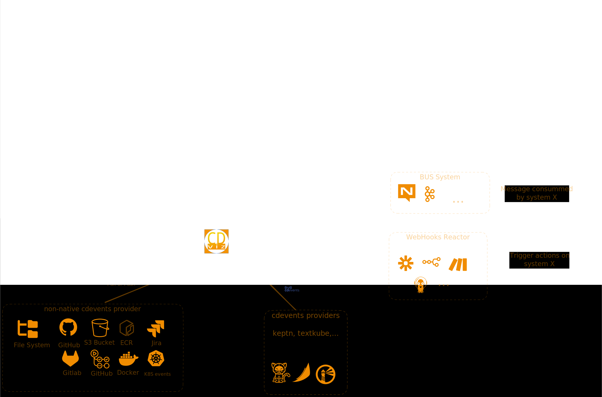

# cdviz

keywords: `cdevents`, `sdlc`, `ci/cd`

CDviz is a comprehensive software delivery lifecycle (SDLC) observability platform built around CDEvents (Cloud native Delivery Events). The system provides visibility into which versions of services are deployed, what tests ran, and the complete flow of events across your development pipeline.

Documentation: <https://cdviz.dev/>

## Core Components

- **[cdviz-collector](https://github.com/cdviz-dev/cdviz-collector)**: Event collection service that gathers events (CI, CD, test, artifacts, etc.) from multiple sources and forwards them to other components (PostgreSQL, third-party services, etc.)
- **cdviz-db**: PostgreSQL database with TimescaleDB extension and golang-migrate migrations for schema management
- **cdviz-grafana**: Dashboard components with custom Grafana panels and dashboards for visualization
- **cdviz-site**: Documentation website built with VitePress and Bun
- **charts/**: Helm charts for Kubernetes deployment
- **demos/**: Docker Compose and Kubernetes deployment examples

## Key Technologies

- **PostgreSQL + TimescaleDB**: Database with golang-migrate for schema migrations
- **TypeScript/Bun**: Grafana dashboards generator and site tooling
- **VitePress**: Documentation site framework
- **Helm**: Kubernetes deployment charts
- **Docker**: Containerization and local development
- **mise**: Task runner and environment management

## Architecture Overview

### Event Flow Architecture

1. **Sources** → cdviz-collector → **Database** → **Dashboards**
2. Events follow CDEvents specification for Cloud Native Delivery Events
3. Database serves as central event store with direct read access for analytics tools
4. Grafana connects directly to PostgreSQL (not through API layer) for full SQL query power

### Database Design

- Uses PostgreSQL with TimescaleDB extension as primary event store
- golang-migrate handles schema migrations in `cdviz-db/migrations/`
- Direct database access pattern for dashboards rather than API abstraction
- Migrations tracked by timestamp with up/down SQL files (YYYYMMDDHHmm format)
- Docker image built with necessary extensions pre-installed

### Dashboard System

- Custom D3.js panels for complex visualizations in `cdviz-grafana/dashboards_generator/src/panels/browser_scripts/`
- TypeScript code generation for Grafana dashboards using Grafana Foundation SDK
- Generated dashboards output to `cdviz-grafana/dashboards/*.json`
- Timeline, execution tracking, and event activity dashboards

### Deployment Options

- **Docker Compose**: Local development stack in `demos/stack-compose/`
- **Kubernetes**: Helm charts with Helmwave configuration in `demos/stack-k8s/`
- **OCI Registry**: Charts published to `ghcr.io/cdviz-dev/charts/`

### Related projects

Maybe with some overlap:

- [sassoftware/event-provenance-registry: The Event Provenance Registry (EPR) is a service that manages and stores events and tracks event-receivers and event-receiver-groups.](https://github.com/sassoftware/event-provenance-registry)
- [RFC : CDEvents-translator design review by rjalander · Pull Request #42 · cdevents/community](https://github.com/cdevents/community/pull/42)
