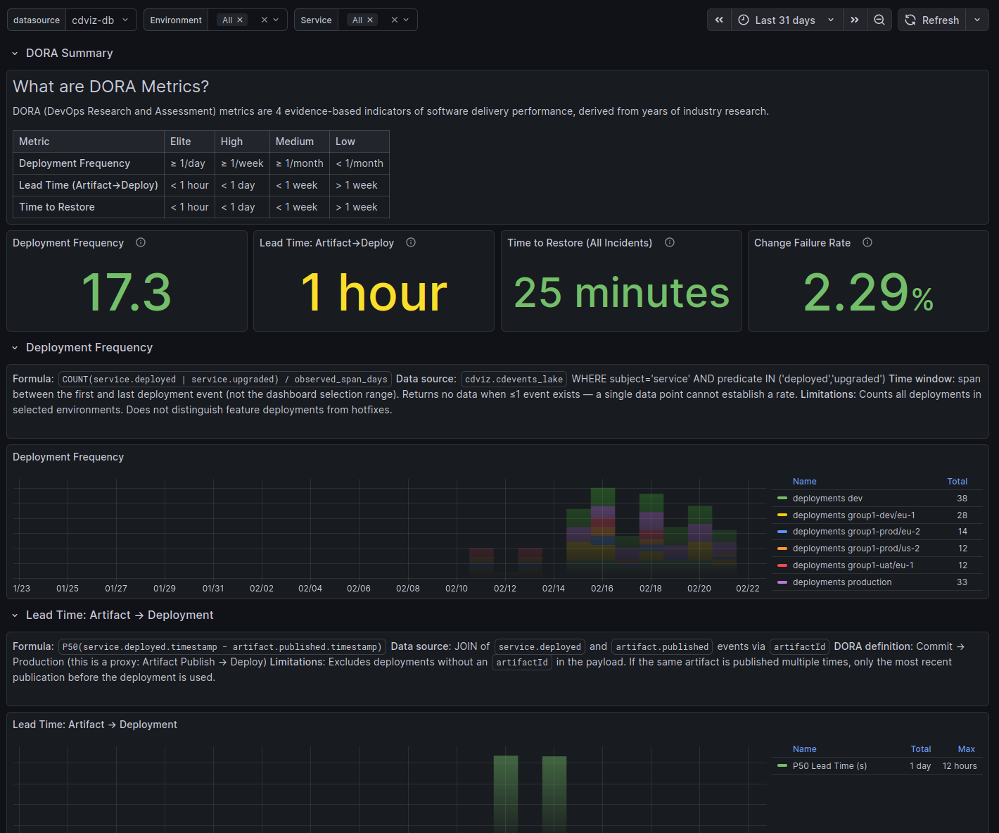
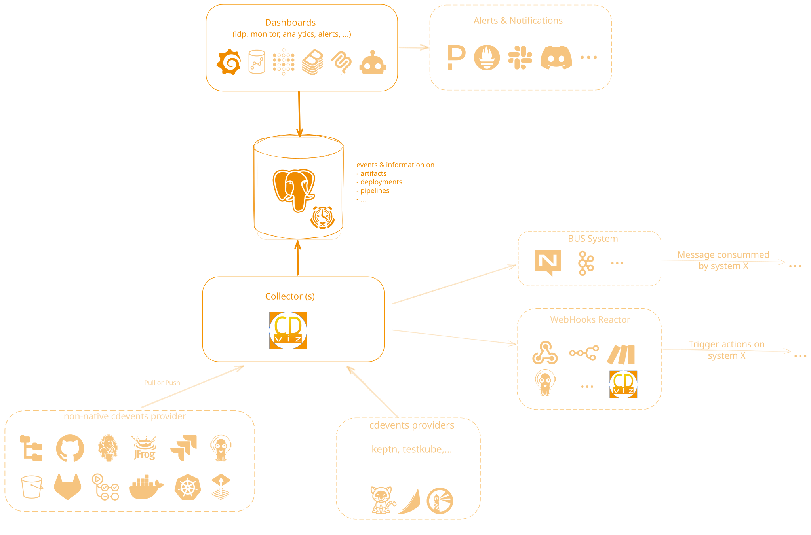

<div align="center">


# See every deploy, test, and incident on one timeline.

**Free, open-source, self-hosted. No lock-in.**

Connect GitHub, GitLab, Kubernetes, and more. Get DORA metrics, deployment timelines, and test results in Grafana — then trigger workflows from the same event stream.

[**▶ Try the live demo**](https://demo.cdviz.dev/grafana/) · [**Self-host it free**](https://cdviz.dev/docs) · [**CDviz Cloud — 14-day free trial**](https://cdviz.dev/cloud)

[](https://github.com/cdviz-dev/cdviz) [](./LICENSE) [](https://cdevents.dev)

[](https://demo.cdviz.dev/grafana/d/dora_metrics/dora-metrics)

<sup>Real dashboard, live data — <a href="https://demo.cdviz.dev/grafana/d/dora_metrics/dora-metrics">click to open this exact dashboard</a>. No signup.</sup>

</div>

## What is CDviz?

CDviz collects, stores, and visualizes software delivery events using the [CDEvents](https://cdevents.dev/) standard — the [CD Foundation](https://cd.foundation)-backed spec for software delivery. It answers operational questions like _"What version is running in production?"_, _"When did we last deploy service X?"_, and _"What is our deployment frequency?"_ — without manually correlating data across CI/CD tools.

Point it at the tools you already use. Nothing to rewrite, no agents to install: GitHub · GitLab · Jenkins · ArgoCD · Kubernetes · Jira · pytest · JUnit · SARIF · [and more](https://cdviz.dev/docs/integrations)

**17 integrations** · **12 dashboards** · **4 DORA indicators** · **Apache 2.0, free forever**

## Sound familiar?

- **You deploy blind.** You know a deploy happened. You don't know if it went to the right env, what version it replaced, or who approved it.
- **Incidents drag on.** Without a shared timeline of changes, you're rebuilding context from Slack threads and git logs instead of restoring service.
- **DORA is a spreadsheet.** Leadership wants DORA metrics. You're copying numbers from 5 dashboards into a Google Sheet every sprint.

## How CDviz compares

|                        | **CDviz**          | [Apache DevLake](https://cdviz.dev/docs/alternatives/vs-apache-devlake) | [Datadog CI](https://cdviz.dev/docs/alternatives/vs-datadog-ci) | [Swarmia](https://cdviz.dev/docs/alternatives/vs-swarmia) / [LinearB](https://cdviz.dev/docs/alternatives/vs-linearb) | Roll your own |
| ---------------------- | ------------------ | ----------------------------------------------------------------------- | --------------------------------------------------------------- | --------------------------------------------------------------------------------------------------------------------- | ------------- |
| **License**            | Apache 2.0         | Apache 2.0                                                              | Proprietary                                                     | Proprietary                                                                                                           | —             |
| **Self-hosted**        | ✅                 | ✅                                                                      | ❌                                                              | ❌                                                                                                                    | ✅            |
| **CDEvents**           | ✅ native          | ❌                                                                      | ❌                                                              | ❌                                                                                                                    | ❌            |
| **Data model**         | **Push + pull**    | Polling only                                                            | Trace-based                                                     | Polling only                                                                                                          | You build it  |
| **Own your data**      | ✅ your PostgreSQL | ✅                                                                      | ❌                                                              | ❌                                                                                                                    | ✅            |
| **Commercial support** | ✅                 | ❌                                                                      | ✅                                                              | ✅                                                                                                                    | ❌            |

CDviz normalizes every input to CDEvents — whether **pushed** in real time (webhooks, Kafka, NATS, SSE) or **pulled** when push isn't available (HTTP polling, file inputs). That's the foundation for event-driven automation, not just dashboards: observe your pipelines, then act on them.

**The honest trade-off:** CDviz ships with fewer ready-made integrations than the larger SaaS platforms, but it is a **toolkit** rather than a closed product — the collector, database, and dashboards each work standalone and are customizable and extensible. You add the integrations you need — custom sources, transformers, storage backends — instead of depending on a fixed catalog.

→ [Full comparison of 14 tools](https://cdviz.dev/docs/alternatives)

## Quick start

Run the whole stack locally — PostgreSQL, Grafana, and the collector, with demo data:

```bash
mise run //demos/stack-compose:up   # then open http://localhost:3000
```

Prefer not to run it yourself? [CDviz Cloud](https://cdviz.dev/cloud) is managed, with a 14-day free trial and no credit card. Or follow the [Getting Started guide](https://cdviz.dev/docs/getting-started) to point CDviz at your own tools.

## Pricing

Free forever, self-hosted, no lock-in. [Cloud](https://cdviz.dev/pricing) (€20/month) adds managed hosting; [Pro](https://cdviz.dev/pricing) (€200/month) adds extra integrations and commercial support. Billed per organization, not per seat.

---

## Components

- **[cdviz-collector](https://github.com/cdviz-dev/cdviz-collector)**: Event collection service that gathers events (CI, CD, test, artifacts, etc.) from multiple sources and forwards them to other components (PostgreSQL, third-party services, etc.) — _separate repository_
- **cdviz-db**: PostgreSQL database with TimescaleDB extension and golang-migrate migrations for schema management
- **cdviz-grafana**: Dashboard components with custom Grafana panels and dashboards for visualization
- **cdviz-site**: Documentation website built with VitePress and Bun
- **charts/**: Helm charts for Kubernetes deployment
- **demos/**: Docker Compose and Kubernetes deployment examples

### Architecture

Events flow **Sources → cdviz-collector → Database → Dashboards**. Grafana connects directly to PostgreSQL rather than through an API layer, so you keep full SQL query power over your own data.



### Dashboards

Generated dashboards cover DORA metrics, artifact timelines, service deployments, pipeline and task runs, test suite/case results, incidents, and ticket lifecycles. → [Dashboard documentation](https://cdviz.dev/docs/cdviz-grafana)

Dashboards are generated from TypeScript via the Grafana Foundation SDK — never edit the JSON directly. See [CONTRIBUTING.md](CONTRIBUTING.md) for development setup, and [CLAUDE.md](CLAUDE.md) for the repository conventions.

### Related projects

Maybe with some overlap:

- [sassoftware/event-provenance-registry: The Event Provenance Registry (EPR) is a service that manages and stores events and tracks event-receivers and event-receiver-groups.](https://github.com/sassoftware/event-provenance-registry)
- [RFC : CDEvents-translator design review by rjalander · Pull Request #42 · cdevents/community](https://github.com/cdevents/community/pull/42)

## Contributing

Contributions welcome — see [CONTRIBUTING.md](CONTRIBUTING.md). All commits require DCO sign-off (`git commit -s`).
