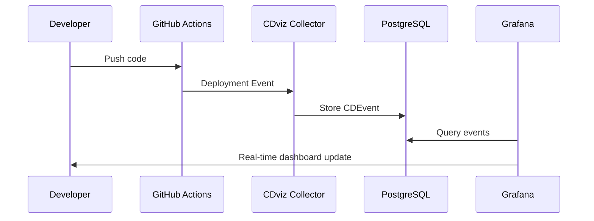
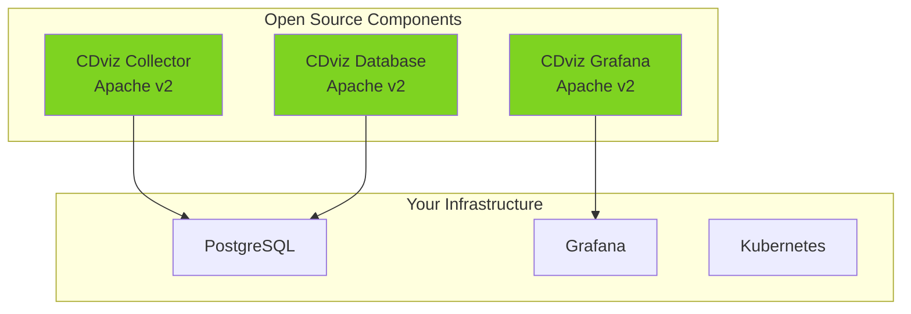
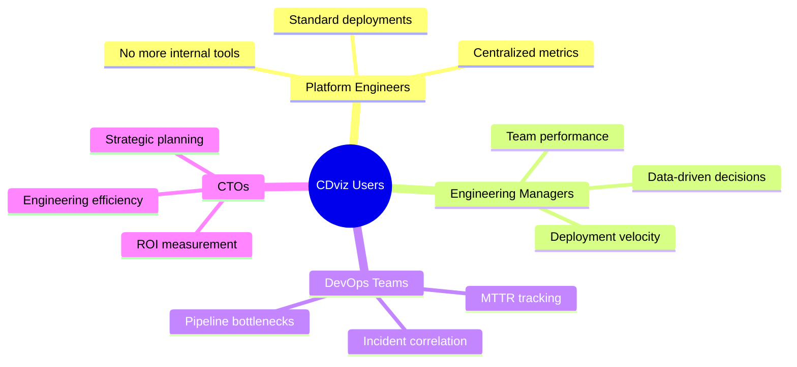

# Stop Flying Blind: Why You Need Pipeline Visibility Yesterday

_Your software delivery metrics are scattered across a dozen tools. Here's how to finally connect the dots._


_The current state: Your pipeline data is trapped in silos_

## The Multi-Tool Nightmare

You've invested in the best CI/CD tools money can buy. Jenkins for builds. GitHub Actions for automation. Kubernetes for orchestration. Datadog for monitoring. PagerDuty for incidents.

Yet when your CEO asks a simple question like "How fast do we actually ship features?" or "What's our deployment success rate?", you find yourself playing detective across 12 different browser tabs, manually correlating timestamps and praying the data makes sense.

### The Visualization of the Problem

```mermaid
graph TB
    A[GitHub Actions] --> Z[???]
    B[Jenkins] --> Z
    C[ArgoCD] --> Z
    D[Datadog] --> Z
    E[PagerDuty] --> Z
    F[Kubernetes] --> Z

    Z --> Q1["❓ Deployment Success Rate?"]
    Z --> Q2["❓ MTTR Across Services?"]
    Z --> Q3["❓ Release Velocity?"]

    style Z fill:#ff6b6b
    style Q1 fill:#ffd93d
    style Q2 fill:#ffd93d
    style Q3 fill:#ffd93d
```



This isn't a tooling problem—it's a **visibility problem**. Your pipeline events are trapped in silos, creating blind spots that make it impossible to answer fundamental questions about your engineering effectiveness.

## Enter CDviz: Monitor Your Software Delivery Pipeline With Confidence

CDviz solves this with a simple but powerful approach: **unified visibility** across your entire software delivery lifecycle. No more tool-hopping. No more manual correlation. Just real-time insights into what's actually happening in your pipeline.


_The CDviz solution: All your pipeline events in one place_

### The Architecture That Makes It Work

```mermaid
graph LR
    subgraph Sources["Event Sources"]
        A[GitHub Actions]
        B[Jenkins]
        C[ArgoCD]
        D[Kubernetes]
        E[PagerDuty]
    end

    subgraph CDviz["CDviz Platform"]
        F[CDviz Collector]
        G[(PostgreSQL + TimescaleDB)]
        H[Grafana Dashboards]
    end

    A --> F
    B --> F
    C --> F
    D --> F
    E --> F

    F --> G
    G --> H

    H --> I[📊 DORA Metrics]
    H --> J[📈 Deployment Frequency]
    H --> K[⏱️ Lead Time]
    H --> L[🔍 Incident Correlation]

    style F fill:#4a90e2
    style G fill:#50e3c2
    style H fill:#7ed321
```



Built on the [CDEvents specification](https://cdevents.dev/)—the emerging Cloud Native standard for delivery events—CDviz breaks down the silos between your CI/CD tools and gives you a single source of truth for delivery events.

## See It In Action: Real Dashboard Screenshots

### Before: Scattered Metrics Across Multiple Tools


_Jenkins: Build status and duration_


_Datadog: Infrastructure monitoring_


_PagerDuty: Incident management_

### After: Unified CDviz Dashboards


_CDviz: All your deployment metrics in one unified view_

Key metrics visible at a glance:

- ✅ Deployment frequency across all services
- ⏱️ Lead time from commit to production
- 🎯 Success/failure rates by environment
- 🔍 Incident correlation with deployments

## The Zero-Friction Difference

**Seamless Integration**: CDviz connects with your existing tools (GitHub, GitLab, Jenkins, Kubernetes) without disrupting your current workflows. Deploy the collector, point it at your tools, and start getting insights immediately.


**Standardized Events**: Every deployment, test run, and incident becomes a standardized CDEvent. This means consistent data structure across all your tools, making correlation and analysis actually possible.

### Visual Event Flow



## Real Problems, Real Dashboard Solutions

Here's what CDviz helps you visualize that your current stack probably can't:

### 1. Deployment Timeline Visualization


_See exactly when each service was deployed across all environments_

### 2. DORA Metrics Dashboard


_Track deployment frequency, lead time, MTTR, and change failure rate_

### 3. Incident Correlation View


_Instantly see which deployments correlate with incidents_

## Getting Started: See Results in 5 Minutes

The fastest way to understand CDviz is to see it in action:

```bash
# Clone and start the demo
git clone https://github.com/cdviz-dev/cdviz.git
cd cdviz/demos/stack-compose
docker compose up

# Access dashboard
open http://localhost:3000/d/demo-service-deployed/demo-service-deployed
```


_The demo environment running locally_

Within minutes, you'll see:

- 📊 Real-time deployment metrics
- 🎯 Service health across environments
- ⚡ Event timeline visualization
- 📈 DORA metrics baseline

## Visual Comparison: Before vs After

| Before CDviz                                                                     | After CDviz                                                                   |
| -------------------------------------------------------------------------------- | ----------------------------------------------------------------------------- |
|  |  |
| 🔴 12+ tools to check                                                            | ✅ Single dashboard                                                           |
| 🔴 Manual correlation                                                            | ✅ Automated insights                                                         |
| 🔴 Hours to investigate                                                          | ✅ Seconds to understand                                                      |
| 🔴 Tribal knowledge                                                              | ✅ Standardized metrics                                                       |

## The Open Source Advantage

CDviz architecture diagram:



This isn't vendor lock-in disguised as open source. Your data lives in PostgreSQL. Your visualizations are in Grafana. You can migrate away at any time, but you won't want to.

## Who Should Care About This

**Visual representation of user personas:**



## Next Steps: Start Your Visual Pipeline Journey

Ready to stop playing deployment detective? Here's your visual roadmap:


1. **Try the demo** (5 minutes): [cdviz.dev](https://cdviz.dev)
2. **Deploy collector** (30 minutes): Point at your existing tools
3. **Configure dashboards** (1 hour): Customize for your metrics
4. **Share insights** (Ongoing): Transform your team's visibility

The future of software delivery observability isn't about more dashboards—it's about **connected, visual insights**. CDviz gives you that clarity.

---

_Ready to see your pipeline clearly? Check out the [live demo](https://cdviz.dev) or explore the [visual documentation](https://github.com/cdviz-dev/cdviz). Questions? The CDviz team is active in the CDEvents community._

---

**Tags**: #DevOps #CI/CD #Observability #Visualization #CDEvents #PostgreSQL #Grafana #Kubernetes #OpenSource #DORA
