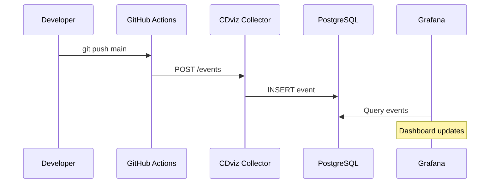

# Connect GitHub Actions to CDviz in 15 Minutes

Last week we looked at the pipeline visibility problem. Today: solve it with working code.

## What We're Building

By the end of this tutorial:

- ✅ CDviz stack running locally
- ✅ GitHub Actions sending deployment events
- ✅ Events visible in Grafana dashboard
- ✅ PostgreSQL storing all event data

## Step 1: Start CDviz Stack (3 minutes)

```bash
# Clone and start
git clone https://github.com/cdviz-dev/cdviz.git
cd cdviz/demos/stack-compose
docker compose up -d

# Verify services
docker compose ps
```

**Expected output**: 4 services running (collector, database, grafana, demo-web)

**Dashboard access**: http://localhost:3000 (admin/admin)

## Step 2: Test Event Collection (2 minutes)

```bash
# Send test deployment event
curl -X POST http://localhost:8080/events \
  -H "Content-Type: application/json" \
  -d '{
    "context": {
      "version": "0.4.0",
      "id": "test-deploy-'$(date +%s)'",
      "source": "manual-test",
      "type": "dev.cdevents.service.deployed.0.1.1",
      "timestamp": "'$(date -u +%Y-%m-%dT%H:%M:%SZ)'"
    },
    "subject": {
      "id": "test-service",
      "type": "service",
      "content": {
        "environment": {"id": "staging"},
        "artifactId": "pkg:oci/test-service@manual"
      }
    }
  }'
```

**Verify**: Check http://localhost:3000/d/demo-service-deployed/demo-service-deployed

Event should appear in timeline immediately.

## Step 3: GitHub Actions Integration (5 minutes)

Add this step to your existing deployment workflow:

```yaml
# .github/workflows/deploy.yml
name: Deploy to Production

on:
  push:
    branches: [main]

jobs:
  deploy:
    runs-on: ubuntu-latest
    steps:
      - uses: actions/checkout@v3

      # Your existing deployment steps here
      - name: Deploy Application
        run: |
          echo "Deploying application..."
          # kubectl apply -f k8s/ or your deployment command

      # NEW: Send CDEvent
      - name: Send Deployment Event
        env:
          CDVIZ_URL: ${{ secrets.CDVIZ_COLLECTOR_URL || 'http://your-cdviz.com:8080' }}
        run: |
          curl -X POST "${CDVIZ_URL}/events" \
            -H "Content-Type: application/json" \
            -d '{
              "context": {
                "version": "0.4.0",
                "id": "${{ github.run_id }}-deployed",
                "source": "github-actions",
                "type": "dev.cdevents.service.deployed.0.1.1",
                "timestamp": "'$(date -u +%Y-%m-%dT%H:%M:%SZ)'"
              },
              "subject": {
                "id": "${{ github.repository }}",
                "source": "${{ github.server_url }}/${{ github.repository }}",
                "type": "service",
                "content": {
                  "environment": {"id": "production"},
                  "artifactId": "pkg:oci/${{ github.repository }}@${{ github.sha }}"
                }
              }
            }'
```

**Required Secret**: Add `CDVIZ_COLLECTOR_URL` to your repository secrets pointing to your CDviz instance.

## Step 4: Deploy and Verify (3 minutes)

1. **Push to main branch** to trigger workflow
2. **Check Actions tab**: Look for "Send Deployment Event" step
3. **View CDviz dashboard**: Event appears with GitHub metadata



## Step 5: Query Your Data (2 minutes)

CDviz stores everything in PostgreSQL. Connect and explore:

```bash
# Connect to database
docker exec -it cdviz-db psql -U postgres -d cdviz

# View recent events
SELECT
  context_id,
  context_source,
  subject_id,
  subject_environment_id,
  timestamp
FROM cdevents
ORDER BY timestamp DESC
LIMIT 10;

# Count deployments by source
SELECT
  context_source,
  COUNT(*) as deployment_count
FROM cdevents
WHERE context_type = 'dev.cdevents.service.deployed.0.1.1'
GROUP BY context_source;
```

**Your data, your queries**. Build custom analytics without API limitations.

## What You Actually Get

### ✅ Available Now

- **Deployment timeline**: See when each service deployed
- **Environment tracking**: Which version is where
- **Event history**: Full PostgreSQL query access
- **Real-time updates**: Dashboard refreshes automatically

### 🔄 Requires Custom Work

- **DORA metrics**: SQL queries available in CDviz docs
- **Team comparisons**: Group by repository owner
- **Custom dashboards**: Grafana supports full customization

### ❌ Not Included

- **Code commit events**: Requires additional GitHub webhook
- **Test result events**: Need CI integration beyond deployment
- **Incident correlation**: Possible with PagerDuty webhook (future tutorial)

## Common Issues & Solutions

**Issue**: `curl: (7) Failed to connect`
**Fix**: Check CDviz collector is running: `docker compose ps`

**Issue**: Event sent but not in dashboard
**Fix**: Verify JSON format with: `curl -v` flag for details

**Issue**: Dashboard shows "No data"
**Fix**: Check time range picker in Grafana (top right)

## Next Steps

**Your homework**: Add CDEvent to one existing workflow this week.

**Article 3 preview**: Production deployment with Kubernetes, Helm charts, and scaling patterns.

## The Bigger Picture

You now have:

- **Standardized events** from GitHub Actions
- **Queryable storage** in PostgreSQL
- **Visual timeline** in Grafana
- **Foundation** for team-wide observability

This scales to multiple repos, teams, and environments using the same pattern.

---

_Working? Share your CDviz dashboard screenshot in the comments. Next week: production-ready deployment patterns._
